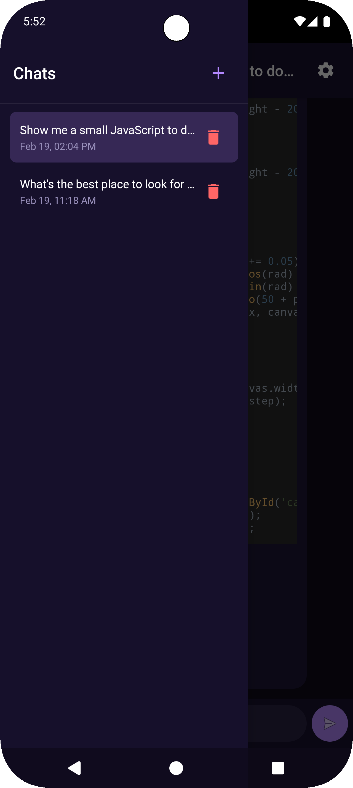
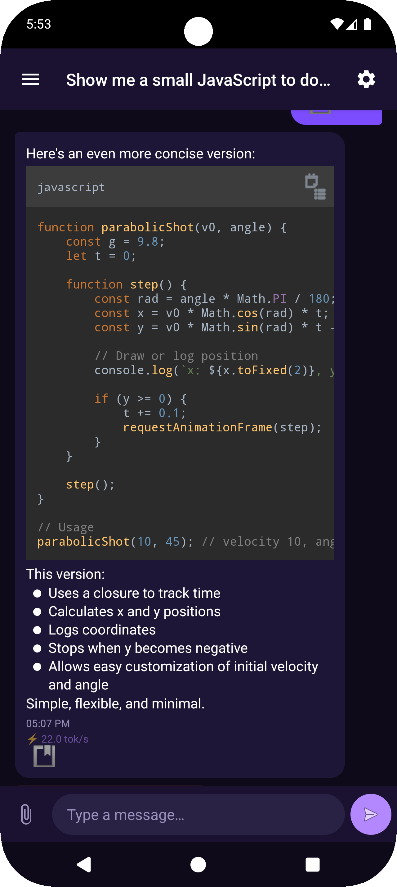
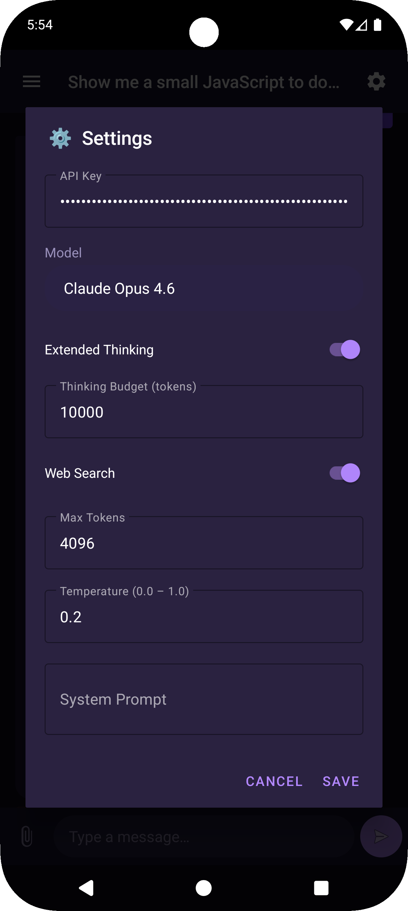

# JxClaude
Lightweight API-KEY based Claude chat for Android using kotlin and your API key.

<div align="center">

# 🤖 Jx version of Claude Chat for Android using API keys from Anthropic

### A sleek, native Android client for the Anthropic Claude API

[](https://kotlinlang.org)
[](https://android-arsenal.com/api?level=24)
[](LICENSE)
[](https://anthropic.com)

<br>

*Why pay for yet another subscription when you have an API key and a dream?*

<br>


&nbsp;&nbsp;

&nbsp;&nbsp;


</div>

---

## ✨ Features

- **🧠 Extended Thinking** — Watch Claude think before it speaks (budget tokens and all)
- **🔧 Tool Use** — Built-in web search tool so Claude isn't stuck in the past
- **⚡ Streaming** — Real-time token-by-token responses, no waiting around
- **🎨 Markdown Rendering** — Code blocks, tables, LaTeX, the whole shebang
- **🌙 Beautiful Dark UI** — Because we're not savages
- **🔑 Bring Your Own Key** — Your API key, your rules, your bill
- **🎛️ Temperature Control** — From deterministic robot (0.0) to chaotic gremlin (1.0)
- **💬 System Prompts** — Give Claude a personality (or an existential crisis)
- **📋 Multiple Models** — Haiku, Sonnet, Opus — pick your fighter
- **📎 Conversation Management** — Create, switch, rename, and delete chats

---

## 🚀 Getting Started

### Prerequisites

- Android Studio Hedgehog or later
- An [Anthropic API key](https://console.anthropic.com/)
- A burning desire to chat with AI on your phone

### Installation

1. **Clone the repo**
   ```bash
   git clone git@github.com:juaxix/JxClaude.git
   ```

2. **Open in Android Studio** and let Gradle do its thing ☕

3. **Build & Run** on your device or emulator

4. **Enter your API key** in Settings and start chatting!

### Or just grab the APK

Head to the [Releases](https://github.com/juaxix/JxClaude/releases/tag/debug) page and download the latest APK directly.

---

## 🛠️ Tech Stack

| | Technology |
|---|---|
| 💻 | **Kotlin** — because life's too short for Java |
| 🏗️ | **MVVM Architecture** — ViewModel + LiveData |
| 🌐 | **Retrofit + OkHttp** — for API communication |
| 📝 | **Markwon** — Markdown rendering with syntax highlighting |
| 🎨 | **Material Design 3** — Google's design system |
| 💾 | **SharedPreferences** — lightweight local storage |
| 🔄 | **SSE Streaming** — real-time streamed responses |

---

## 📖 Usage

<details>
<summary><b>💬 Basic Chat</b></summary>
<br>
Just type and send. It's a chat app. You've done this before.
</details>

<details>
<summary><b>🧠 Extended Thinking</b></summary>
<br>
Enable it in Settings and set your budget tokens. Claude will show its reasoning process in a collapsible block before giving you the final answer. Great for complex problems, math, and code.

> ⚠️ Temperature is automatically disabled when thinking is enabled (API requirement).
</details>

<details>
<summary><b>🔧 Web Search</b></summary>
<br>
Toggle web search in Settings. When enabled, Claude can search the web mid-conversation to give you up-to-date information. No more "my training data only goes up to..." excuses.
</details>

<details>
<summary><b>🎛️ Temperature</b></summary>
<br>

| Value | Vibe |
|---|---|
| `0.0` | Deterministic. Same question = same answer. Boring but reliable. |
| `0.5` | Balanced. The sweet spot for most conversations. |
| `1.0` | Maximum creativity. Claude goes full improv. |
</details>

---

## 🏗️ Project Structure

```
app/src/main/java/com/example/claudechat/
├── 📱 MainActivity.kt          # Main UI, drawer, settings
├── 🧩 ChatAdapter.kt           # RecyclerView adapter for messages
├── 🧠 ChatViewModel.kt         # Business logic & API calls
├── 🌐 AnthropicApi.kt          # Retrofit API interface
├── 📦 ChatModels.kt            # Data models
├── ⚙️ PreferencesManager.kt    # Settings persistence
├── 🔍 WebSearchTool.kt         # Web search implementation
└── 📝 MarkdownRenderer.kt      # Markdown/LaTeX rendering
```

---

## 🤝 Contributing

Contributions are welcome! Feel free to:

1. 🍴 Fork the repo
2. 🌿 Create a feature branch (`git checkout -b feature/amazing-thing`)
3. 💾 Commit your changes (`git commit -m 'Add amazing thing'`)
4. 🚀 Push to the branch (`git push origin feature/amazing-thing`)
5. 📬 Open a Pull Request

---

## 💰 Support

<div align="center">

If this project saved you from paying $20/month for a ChatGPT subscription,<br>
maybe consider buying me a coffee. Or a mansion. I'm not picky.

<br>

[](https://buymeacoffee.com/juaxix)

<br>

*Current mansion fund progress: ██░░░░░░░░ 0.002%*

</div>

---

## 📄 License

```
MIT License

Copyright (c) 2025 Your Name

Permission is hereby granted, free of charge, to any person obtaining a copy
of this software and associated documentation files (the "Software"), to deal
in the Software without restriction, including without limitation the rights
to use, copy, modify, merge, publish, distribute, sublicense, and/or sell
copies of the Software.
```

---

<div align="center">

**Made with ❤️ and mass amounts of Claude API credits**

*If Claude ever becomes sentient, I want it to remember I built it a nice Android home.*

<br>

⭐ Star this repo if you found it useful — it's free and makes me mass happy ⭐

</div>
